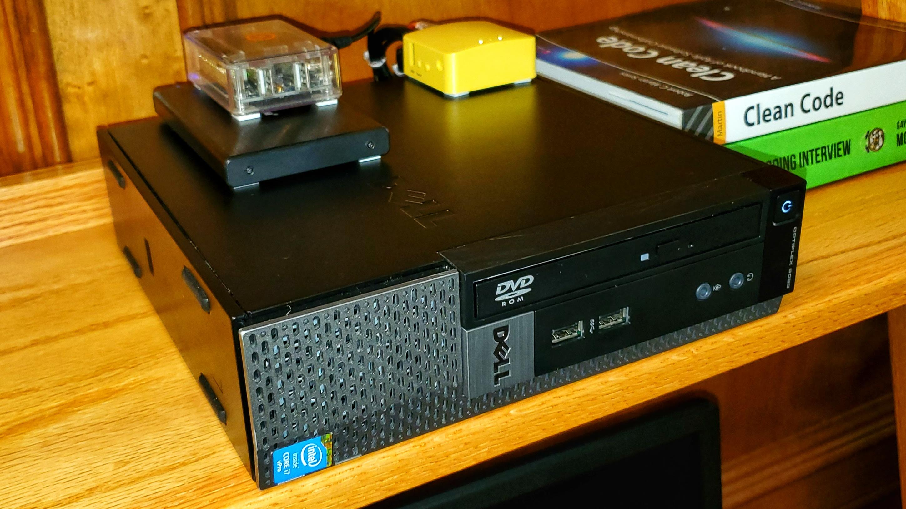
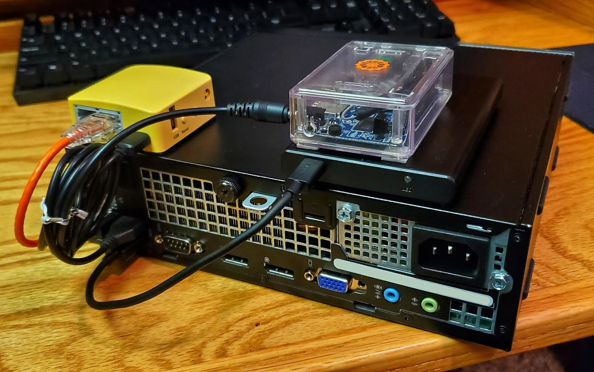

# Home lab
Various scripts and files for my home server.
Used for debian based distributions.

Currently installs docker and starts various containers using docker-compose

## Usage	
Run the following as root user
```shell
wget -O - https://git.io/JvATB | bash
```

## Current Hardware




### Dell Optiplex USFF 9020

Running Ubuntu Server 18.04.4 LTS. Used as a docker host for experimentation with containerization.

- 8gb RAM
- i7-4770S
- 2 x 128gb SSD

### Orange Pi Lite

Running [Armbian](https://www.armbian.com/) (Debian for ARM development boards). It is setup as a DNS server for network-wide adblocking using [Pi-hole](https://pi-hole.net/)

- 512MB RAM
- Allwinner H3 SoC
- 8gb SD card

### GL.iNET GL-MT300N-V2 Travel Router

Excellent little router at the heart of the network. Runs an [OpenWRT](https://openwrt.org/) based firmware out of the box so it is full of features and very extensible. The LEDs, and the physical switch on the side can be customized to perform various actions.

At the moment, The switch is mapped to an OpenVPN client on the router. At the flick of a switch, all traffic on the network gets routed via a VPN.

- 300Mbps (2.4GHz) WiFi - 802.11 b/g/n
- 2 x 10/100M Ethernet Ports
- 1 x USB 2.0 Port
- 128MB RAM
- 16MB ROM
