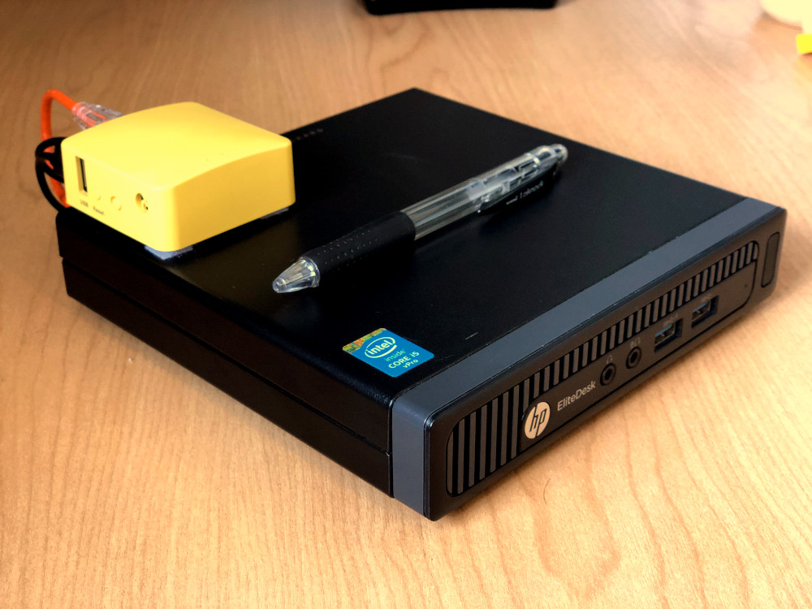
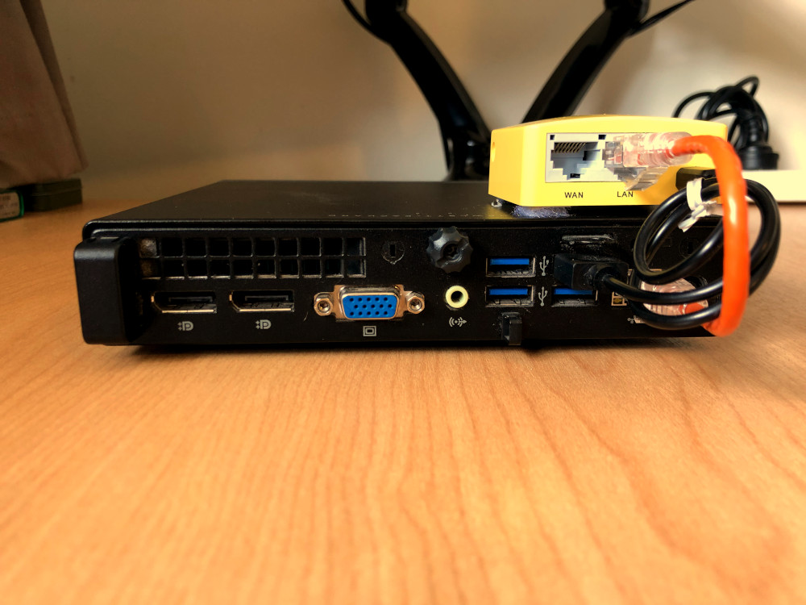

# Homelab

>*labroratory (noun)*: a place providing opportunity for experimentation, observation, or practice in a field of study.

This repository contains various scripts and files for my home server. Used for debian based distributions.

## Design Decisions

- Infrastructure-as-code is used where possible, eliminating manual processes and allowing for an iterative approach to infrastructure management.
- Connections to services are managed using a point-to-point VPN ([tailscale](https://github.com/tailscale/tailscale), utilising the opensource control server, [headscale](https://github.com/juanfont/headscale)). This prevents the need for portforwarding & static IPs for the server. It minimises the attack surface by reducing exposed services to the internet.
- Sensitive data, such as terraform state files and keys, are counter-intuitively version controlled right here in this public repository using [transcrypt](https://github.com/elasticdog/transcrypt). It is a bash script that utilises OpenSSL's symmetric cipher routines to seamlessly encrypt/decrypt files specified in the `.gitattributes` file.
- Deployments are made using the [3musketeers](https://3musketeers.io/guide/) pattern, to provide a consistent, OS agnostic, developer experience.

## Setting Up

### Prerequisites (Manual Steps)

- A google cloud project and a service account key downloaded to `terraform/gcp_key.json`. See [set up GCP](#set-up-gcp).
- Domain to use for the headscale control server.
- Server or VM with a fresh debian install, setup with ssh key access. This will run the services.
- Machine to orchestrate the installation from with the [3musketeers](https://3musketeers.io/guide/) installed:
    - Make
    - Docker
    - Docker Compose

#### Set up GCP

After creating your GCP account, create or modify the following resources to enable Terraform to provision your infrastructure:

A GCP Project: GCP organizes resources into projects. Create one now in the GCP console and make note of the project ID. You can see a list of your projects in the cloud resource manager.

Google Compute Engine: Enable Google Compute Engine for your project in the GCP console. Make sure to select the project you are using to follow this tutorial and click the "Enable" button.

A GCP service account key: Create a service account key to enable Terraform to access your GCP account. When creating the key, use the following settings:
    Select the project you created in the previous step.
    Click "Create Service Account".
    Give it any name you like and click "Create".
    For the Role, choose "Project -> Editor", then click "Continue".
    Skip granting additional users access, and click "Done".

After you create your service account, download your service account key.
    Select your service account from the list.
    Select the "Keys" tab.
    In the drop down menu, select "Create new key".
    Leave the "Key Type" as JSON.
    Click "Create" to create the key and save the key file to your system.
    Copy the contents of the keyfile to `./terraform/gcp_key.json`

You can read more about service account keys in Google's documentation.


### Setup cloud infrastructure

See [headscale.net](https://headscale.net/stable/) for more details about what headscale is.

Update `terraform/terraform.tfvars` with the required values.

```shell
make tf-init
make tf-apply
```

This will initialise a gcp vm instance and install headscale on it.

The terraform should output the external ip of the newly created headscale instance.

Access your DNS registrar and update the `server_url` to the `headscale_ip_address` outputed from terraform.

You should now have a running headscale server ready to orchestrate vpn connections between your clients.

### Initialise local services

Ensure you have a machine running that you would like to deploy your services to and that you have ssh key access to it.

```shell
cd ansible
ANSIBLE_SSH_PIPELINING=1 ansible-playbook playbook.yaml -i inventory.yaml --ask-become-pass
```

## Hardware




### HP Elitedesk 800 G1 Mini

Running Debian 11 Bullseye. Used as a docker host for experimentation with containerization. Fits in the palm of my hand and sips power.

- 8gb RAM
- i5-4570
- 1 x 128gb SSD

### GL.iNET GL-MT300N-V2 Travel Router

Small travel router running an [OpenWRT](https://openwrt.org/) based firmware out of the box so it is full of features and very extensible. The LEDs, and the physical switch on the side can be customized to perform various actions.

At the moment, The switch is mapped to an OpenVPN client on the router. At the flick of a switch, all traffic on the network gets routed via a VPN.

- 300Mbps (2.4GHz) WiFi - 802.11 b/g/n
- 2 x 10/100M Ethernet Ports
- 1 x USB 2.0 Port
- 128MB RAM
- 16MB ROM

https://www.reddit.com/r/Tailscale/comments/104y6nq/docker_tailscale_and_caddy_with_https_a_love_story/